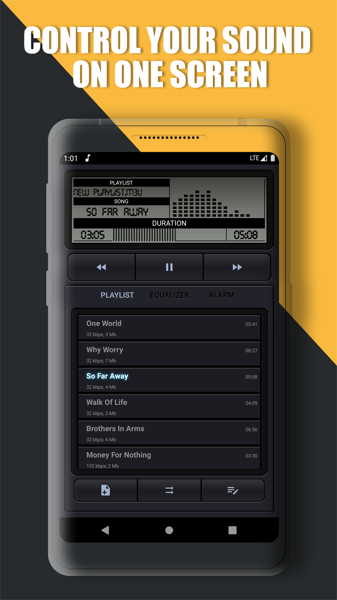
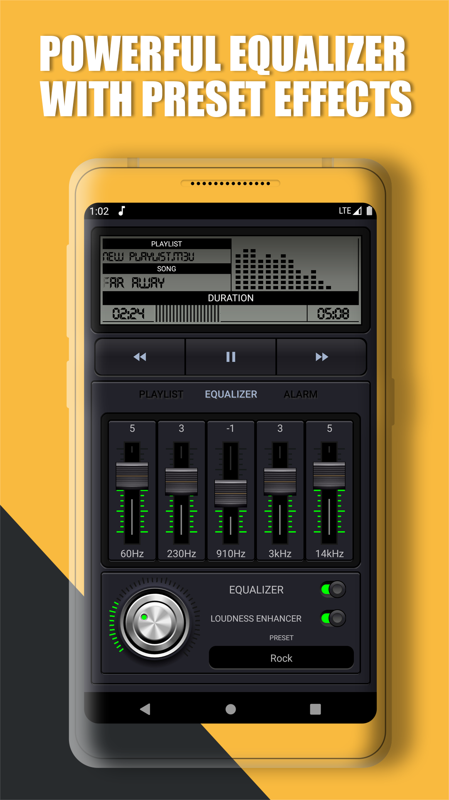
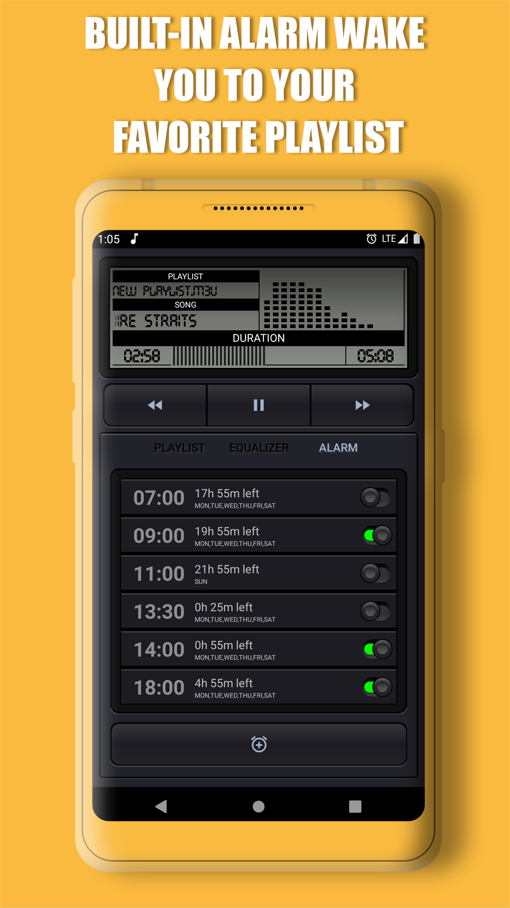
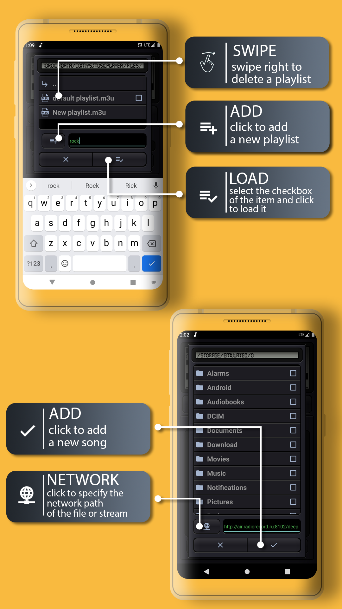
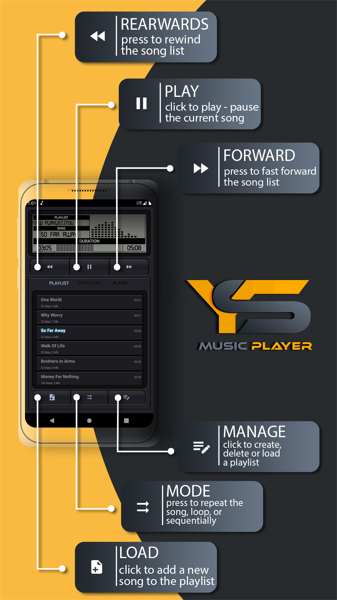

# YES Music Player 2.0

The YES Music Player 2.0 project exemplifies
modern [Android](https://en.wikipedia.org/wiki/Android_(operating_system)) application development
methodologies and provides comprehensive architectural guidance. By integrating popular development
tools, libraries, along with robust testing frameworks, this project offers a holistic sample of a
fully operational Android application.

The primary focus of this project lies in promoting a modular, scalable, maintainable, and
testable [architecture](#architecture). It incorporates a leading-edge [tech-stack](#tech-stack) and
embodies the finest practices in software development. While the application may appear
straightforward, it encompasses all the crucial components that lay the groundwork for a robust,
large-scale application.

The design principles and architectural choices applied in this project are ideally suited for
larger teams and
extended [application lifecycles](https://en.wikipedia.org/wiki/Application_lifecycle_management).
This application is not just about showcasing functionalities, but it is also a testament to how
well-structured and well-written code serves as a stable backbone for scalable and maintainable
software development projects.

- [YES Music Player 2.0](#-YES-Music-Player-2.0)
    - [Application Scope](#application-scope)
    - [Tech-Stack](#tech-stack)
    - [Architecture](#architecture)
        - [Module Types And Module Dependencies](#module-types-and-module-dependencies)
        - [Feature Module Structure](#feature-module-structure)
            - [Presentation Layer](#presentation-layer)
            - [Domain Layer](#domain-layer)
            - [Data Layer](#data-layer)
    - [Dependency Management](#dependency-management)
    - [Getting Started](#getting-started)
        - [Android Studio](#android-studio)
    - [Inspiration](#inspiration)
        - [Cheatsheet](#cheatsheet)
    - [Author](#author)
    - [License](#license)
   

## Application Scope

The YES Music Player 2.0 is an application that plays music on your android device.

The app has a few screens located in multiple feature modules:

- Player screen - displays information about current track and contains buttons to control playback
- Playlist screen - displays information about tracks in a playlist contains buttons to contains
buttons for calling dialogs for loading tracks into a playlist and managing playlists
- Equalizer screen - empty (Work in Progress)
- AlarmClock screen - empty (Work in Progress)
  <br/><br/>

<p>
  
  
  
  
  
</p>

## Tech-Stack

This project takes advantage of best practices and many popular libraries and tools in the Android
ecosystem.
* Tech-stack
    * [100% Kotlin](https://kotlinlang.org/)
        + [Coroutines](https://kotlinlang.org/docs/reference/coroutines-overview.html) - perform
          background operations
        + [Kotlin Flow](https://kotlinlang.org/docs/flow.html) - data flow across all app layers,
          including views
        + [Kotlin Symbol Processing](https://kotlinlang.org/docs/ksp-overview.html) - enable
          compiler plugins
    * [Jetpack](https://developer.android.com/jetpack)

        * [Lifecycle](https://developer.android.com/topic/libraries/architecture/lifecycle) -
          perform an action when
          lifecycle state changes
        * [ViewModel](https://developer.android.com/topic/libraries/architecture/viewmodel) - store
          and manage UI-related
          data in a lifecycle-aware way
        * [Room](https://developer.android.com/jetpack/androidx/releases/room) - store offline cache
* Modern Architecture
    * [Clean Architecture](https://blog.cleancoder.com/uncle-bob/2012/08/13/the-clean-architecture.html)
    * Single activity architecture
    * MVI (presentation layer)
    * [Android Architecture components](https://developer.android.com/topic/libraries/architecture)
      ([ViewModel](https://developer.android.com/topic/libraries/architecture/viewmodel)
      , [Kotlin Flow](https://kotlinlang.org/docs/flow.html))
    * [Android KTX](https://developer.android.com/kotlin/ktx) - Jetpack Kotlin extensions
* UI
    * [View Binding](https://developer.android.com/topic/libraries/view-binding) - retrieve XML view
      ids
    * [Material Design 3](https://m3.material.io/) - application design system providing UI
      components
    * Theme selection
        * [Dark Theme](https://material.io/develop/android/theming/dark) - dark theme for the app (
          Android 10+)
        * [Dynamic Theming](https://m3.material.io/styles/color/dynamic-color/overview) - use
          generated, wallpaper-based
          theme (Android 12+)
* Testing
    * [Robot pattern](https://jakewharton.com/testing-robots/) -Robot pattern fits
      with Espresso and allows to create clear and understandable tests. 
    * [Unit Tests](https://en.wikipedia.org/wiki/Unit_testing) ([JUnit 5](https://junit.org/junit5/)
      via [android-junit5](https://github.com/mannodermaus/android-junit5)) - parameterized test individual classes
    * [UI Tests](https://en.wikipedia.org/wiki/Graphical_user_interface_testing) ([Espresso](https://developer.android.com/training/testing/espresso)) -
      test user interface 
    * [Mockk](https://mockk.io/) - mocking framework
    * [Turbine](https://github.com/cashapp/turbine) - small testing library for kotlinx.coroutines Flow.
* Gradle
    * [libs.versions.toml](https://developer.android.com/build/migrate-to-catalogs) -
      define dependencies

## Architecture

By dividing a problem into smaller and easier-to-solve sub-problems, we can reduce the complexity of
designing and
maintaining a large system. Each module is an independent build block serving a clear purpose. We
can think about each
feature as a reusable component, the equivalent
of [microservice](https://en.wikipedia.org/wiki/Microservices) or private
library.

The modularized code-base approach provides a few benefits:

- reusability - enable code sharing and building multiple apps from the same foundation. Apps should
  be a sum of their features where the features are organized as separate modules.
- [separation of concerns](https://en.wikipedia.org/wiki/Separation_of_concerns) - each module has a
  clear API.
  Feature-related classes live in different modules and can't be referenced without explicit module
  dependency. We
  strictly control what is exposed to other parts of your codebase.
- features can be developed in parallel eg. by different teams
- each feature can be developed in isolation, independently from other features
- faster build time

### Module Types And Module Dependencies

We have three kinds of modules in the application:

- `app` module - this is the main module. It contains code that wires multiple modules together (
  class, dependency
  injection setup, etc.) and fundamental application configuration (retrofit configuration, required
  permissions setup, custom `Application` class, etc.).
- `x_Feature` modules - the most common type of module containing all code related to a given
  feature.
- `core` modules that feature modules depend on to share a common code.
- `coreUI` module that feature modules depend on to share a common UI resources.

### Feature Module Structure

`Clean Architecture` is implemented at the module level - each module contains its own set of Clean
Architecture layers: Presentation,Domain and Data.
Each feature module contains non-layer components and 3 layers with a distinct set of
responsibilities. Non-Layered components are: Di - dependency injection,Tests,Android resources, Gradle build script,
AndroidManifest

#### Presentation Layer

This layer is closest to what the user sees on the screen.

The `presentation` layer mixes `MVVM` and `MVI` patterns:

- `MVVM` - Jetpack `ViewModel` is used to encapsulate a `common UI state`. It exposes the `state`
  via observable state
  holder (`Kotlin Flow`)
- `MVI` - `action` modifies the `common UI state` and emits a new state to a view via `Kotlin Flow`

> The `common state` is a single source of truth for each view. This solution derives from
> [Unidirectional Data Flow](https://en.wikipedia.org/wiki/Unidirectional_Data_Flow_(computer_science))
> and [Redux
> principles](https://redux.js.org/introduction/three-principles).

This approach facilitates the creation of consistent states. The state is collected
via `collectAsUiStateWithLifecycle`
method. Flows collection happens in a lifecycle-aware manner, so
[no resources are wasted](https://medium.com/androiddevelopers/consuming-flows-safely-in-jetpack-compose-cde014d0d5a3).

Components:

- **View (Fragment)** - observes common view state (through `Kotlin Flow`). Compose transform
  state (emitted by Kotlin
  Flow) into application UI Consumes the state and transforms it into application UI (
  via `Jetpack Compose`). Pass user
  interactions to `ViewModel`. Views are hard to test, so they should be as simple as possible.
- **ViewModel** - emits (through `Kotlin Flow`) view state changes to the view and deals with user
  interactions (these
  view models are not simply [POJO classes](https://en.wikipedia.org/wiki/Plain_old_Java_object)).
- **ViewState** - common state for a single view

#### Domain Layer

This is the core layer of the application. Notice that the `domain` layer is independent of any
other layers. This
allows making domain models and business logic independent from other layers. In other words,
changes in other layers
will not affect the `domain` layer eg. changing the database (`data` layer) or screen
UI (`presentation` layer) ideally will
not result in any code change within the `domain` layer.

Components:

- **UseCase** - contains business logic
- **DomainModel** - defines the core structure of the data that will be used within the application.
  This is the source
  of truth for application data.
- **Repository interface** - required to keep the `domain` layer independent from
  the `data layer` ([Dependency inversion](https://en.wikipedia.org/wiki/Dependency_inversion_principle)).

#### Data Layer

Encapsulates application data. Provides the data to the `domain` layer eg. retrieves data from the
internet and cache the
data in disk cache (when the device is offline).

Components:

- **Repository** is exposing data to the `domain` layer. Depending on the application structure and
  quality of the
  external API repository can also merge, filter, and transform the data. These operations intend to
  create
  a high-quality data source for the `domain` layer. It is the responsibility of the Repository (one
  or more) to construct
  Domain models by reading from the `Data Source` and accepting Domain models to be written to
  the `Data Source`
- **Mapper** - maps `data model` to `domain model` (to keep `domain` layer independent from
  the `data` layer).

This application has `Data Source` -  `Room` (local storage used to access
device persistent memory). These data source can be treated as an implicit sub-layer. Data source
consists of
multiple classes:

- **Room Database** - persistence database to store app data
- **Room DAO** - interact with the stored data
- **Room Entity** - definition of the stored objects

`Room Entities` contain annotations, so the given framework understands how to parse the
data into objects.

## Dependency Management

The [libs.versions.toml](https://developer.android.com/build/migrate-to-catalogs) file is a way to organize and manage versions of libraries and dependencies
in your project using the TOML (Tom's Obvious, Minimal Language) format. This file helps keep
versions up to date and makes it easier to manage dependencies in your project.

### Installation
Creating a libs.versions.toml file: If you don't already have a
[libs.versions.toml](https://developer.android.com/build/migrate-to-catalogs) file, create
one in your project's root directory.

### Adding dependencies
In the [libs.versions.toml](https://developer.android.com/build/migrate-to-catalogs) file, define the dependencies and specify the
versions for each of them. Example:
```toml
[dependencies]
kotlin = "1.5.21"
androidx.appcompat = "1.3.1"
retrofit2 = "2.9.0"
```
You can specify libraries and their versions according to your needs.

### Project use
Import the [libs.versions.toml](https://developer.android.com/build/migrate-to-catalogs) file: In your project, import the libs.versions.toml file into the appropriate module or script where you want to use these dependencies.

Using versions in dependencies: In your Gradle file (e.g. build.gradle or build.gradle.kts), use versions from libs.versions.toml instead of hardcoding versions. Example:

In the build.gradle.kts file:
```kotlin
dependencies {
    implementation("org.jetbrains.kotlin:kotlin-stdlib-jdk8: ${kotlin}")
    implementation("androidx.appcompat:appcompat: ${androidx.appcompat}")
    implementation("com.squareup.retrofit2:retrofit: ${retrofit2}")
}
```
### Dependency Synchronization
After updating the versions in the [libs.versions.toml](https://developer.android.com/build/migrate-to-catalogs) file,
restart Gradle dependency synchronization in your project. This will update the dependencies
based on the versions specified in the file.

### Updating versions
To update the versions of libraries in your project, edit the 
[libs.versions.toml](https://developer.android.com/build/migrate-to-catalogs) file to specify
the new versions for the relevant dependencies. After this, restart Gradle dependency
synchronization.

### Conclusion
Using the [libs.versions.toml](https://developer.android.com/build/migrate-to-catalogs)
file simplifies dependency management in your project, making
the update and version control process more convenient and straightforward. Implement this
method into your development process to make working with libraries and dependencies easier.

## Getting Started
### E2E test
Put to trackdialogFeature Assets folder your music files to test on real data.

There are a few ways to open this project.

### Android Studio

1. `Android Studio` -> `File` -> `New` -> `From Version control` -> `Git`
2. Enter `https://github.com/Yeroshin/YES_MusicPlayer.git` into URL field and press `Clone` button

### Command-line And Android Studio

1. Run `git clone https://github.com/Yeroshin/YES_MusicPlayer.git` command to clone the project
2. Open `Android Studio` and select `File | Open...` from the menu. Select the cloned directory and
   press `Open` button

## Inspiration

Here are a few additional resources.

### Cheatsheet

- [Material Theme Builder](https://m3.material.io/theme-builder#/dynamic) - generate dynamic
  material theme and see it
  in action
- [Compose Material 3 Components](https://developer.android.com/reference/kotlin/androidx/compose/material3/package-summary)
  \- a list containing material components
- [Core App Quality Checklist](https://developer.android.com/quality) - learn about building the
  high-quality app
- [Kotlin Coroutines - Use Cases on Android](https://github.com/LukasLechnerDev/Kotlin-Coroutine-Use-Cases-on-Android) -
  most popular coroutine usages

### Other

- [Software Testing Fundamentals](https://softwaretestingfundamentals.com/) - great summary on
  application testing

## Author
[](https://www.linkedin.com/in/stanislav-yeroshin/){height="200px" width="200px"}

## License

```
MIT License

Copyright (c) 2023 Yeroshin Stanislav

Permission is hereby granted, free of charge, to any person obtaining a copy of this software and
associated documentation files (the "Software"), to deal in the Software without restriction, including
without limitation the rights to use, copy, modify, merge, publish, distribute, sublicense, and/or sell
copies of the Software, and to permit persons to whom the Software is furnished to do so, subject to
the following conditions:

The above copyright notice and this permission notice shall be included in all copies or substantial
portions of the Software.

THE SOFTWARE IS PROVIDED "AS IS", WITHOUT WARRANTY OF ANY KIND, EXPRESS OR IMPLIED, INCLUDING BUT NOT
LIMITED TO THE WARRANTIES OF MERCHANTABILITY, FITNESS FOR A PARTICULAR PURPOSE AND NONINFRINGEMENT. IN
NO EVENT SHALL THE AUTHORS OR COPYRIGHT HOLDERS BE LIABLE FOR ANY CLAIM, DAMAGES OR OTHER LIABILITY,
WHETHER IN AN ACTION OF  TORT OR OTHERWISE, ARISING FROM, OUT OF OR IN CONNECTION WITH THE
SOFTWARE OR THE USE OR OTHER DEALINGS IN THE SOFTWARE.
```


